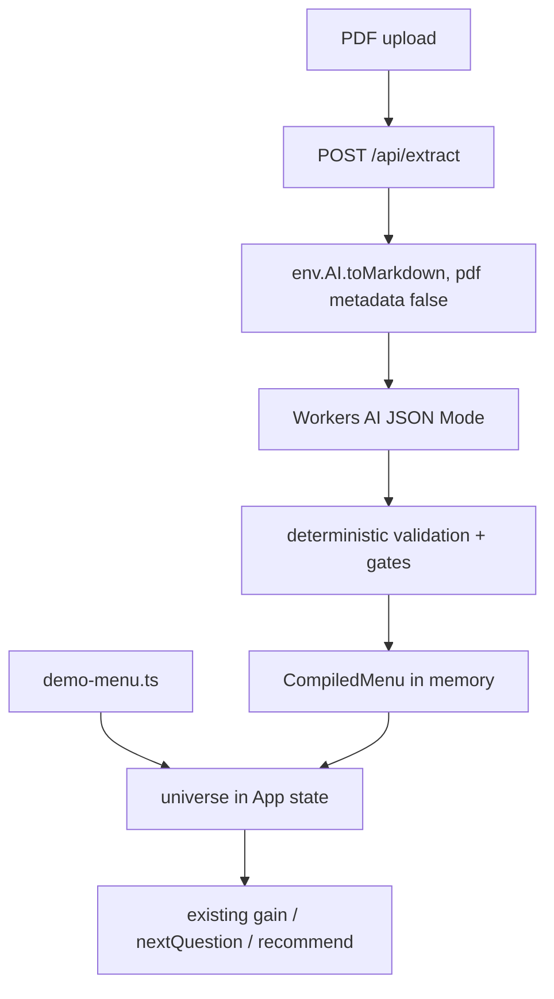

# PDF menu extraction

Branch: `feature/pdf-menu-extraction`. No `pnpm run deploy` from this branch. `main` stays as deployed.

Note on tooling: the Cloudflare Skills plugin is **not** installed in this environment (`~/.cursor/plugins/local` is empty). API surfaces below were confirmed against live Cloudflare docs: `toMarkdown` conversion options, the `ConversionResult` error shape, and JSON Mode.

---

## 1. What the repo actually looks like

**Engine (pure, no React):** [src/lib/entropy.ts](src/lib/entropy.ts) (`H`, `FILTER_OPTIONS`, `subpool`, `gain`, `ASK_COST`), [src/lib/flow.ts](src/lib/flow.ts) (`nextQuestion`, phases, exhaust reasons, `entropyTrace`), [src/lib/recommend.ts](src/lib/recommend.ts) (`tieBreak`, `SIDES`), [src/lib/stats.ts](src/lib/stats.ts) (`dietFilter`, `statsOf`).

**Worker:** [worker/index.ts](worker/index.ts) is a stub — `/api/*` returns `{name:"Cloudflare"}`, everything else 404. Assets are served by the plugin before the Worker runs. [wrangler.jsonc](wrangler.jsonc) has **no bindings at all** (no `ai`).

**Tests:** [src/lib/entropy.test.ts](src/lib/entropy.test.ts), [src/lib/flow.test.ts](src/lib/flow.test.ts), 21/21 green, node environment via [vitest.config.ts](vitest.config.ts).

### Tracing one item to a recommendation

`MENU` (21 items) -> `dietFilter(diet)` -> `universe` -> `filterProducts(answers, universe)` -> `pool` -> `gain` per unanswered filter -> `nextQuestion` picks argmax over `ASK_COST` -> config questions -> `recommend()` -> `Results` renders `pick.name` + `plain`.



### The integration seam

One seam: the `universe` memo in [src/App.tsx](src/App.tsx). Everything downstream already takes `universe` as a prop, **except three direct `MENU` imports** that must become parameters:

- `dietFilter()` in [src/lib/stats.ts](src/lib/stats.ts) — hardcodes `MENU`
- `recommend()` fallback in [src/lib/recommend.ts](src/lib/recommend.ts)
- `MENU.length` in [src/components/DecompileLog.tsx](src/components/DecompileLog.tsx)

---

## 2. Central design question: closed unions vs arbitrary menus

Options considered:

- **A. Same-domain MVP only.** Reject anything that is not chicken-shop shaped. Cheapest, but a blind test with a real unseen PDF almost certainly fails, and it is coercion by another name.
- **B. Fully derived vocabulary.** LLM proposes arbitrary dimensions per menu; engine becomes generic over an N-dimension schema. Most honest, but rewrites the engine, `QUESTIONS`, and every component that reads `HEAT`/`SIDES`/`cut`. Disproportionate.
- **D. Fixed dimension shape, per-menu vocabulary (recommended).** Keep the three slots (`format`, `protein`, `style`) and the identify/configure phasing. Derive the **option values and labels** per uploaded menu, in the menu's own words.

**Recommendation: D.** The three slots are already abstract (how it is served / main component / flavour family) and generalise across pizza, curry, deli. Crucially it turns out to be surgical, not a rewrite:

- `subpool()` needs **no change**. Validation requires vegetarian items to carry `proteins: ["veg"]`, which is exactly the invariant the existing veg branch assumes.
- `gain(qid, pool, options = FILTER_OPTIONS)` — one optional trailing param.
- `nextQuestion(answers, pool, opts?)` where `opts = { filterOptions, hasSides }`, defaulting to current behaviour.
- `FILTER_QUESTION_IDS` is unchanged because the slots are fixed.

Type widening without losing demo safety:

```ts
export interface CompiledItem {
  id: string; name: string; plain: string;
  format: string; proteins: string[]; styles: string[];
  vegetarian: boolean; vegan: boolean; heat: boolean; portion: boolean;
}
export interface MenuItem extends CompiledItem {
  format: Format; proteins: Protein[]; styles: Style[];
}
```

Engine functions become `<T extends CompiledItem>(pool: T[]) => T[]`, so `MENU` still type-checks and existing tests call the same signatures. **Both test files stay byte-identical and the verified numbers are untouched.**

Uploaded menus get: `hasSides: false` (we never invent sides), a neutral app-authored heat scale when any item is heat-configurable, and `buildQuestions(vocabulary)` for prompts/labels.

---

## 3. Rule redlines (own commit, before feature code)

### `.cursor/rules/000-project.mdc` rule 6

```diff
-6. NO real branded product names anywhere — dataset, UI, or extraction output.
-   Items are described generically by their components. Do not add a
-   "(on menu as X)" mapping. This is a hard rule, not a stylistic preference.
+6. Branded names: two different postures, by provenance.
+   a. The SHIPPED DEMO DATASET stays generic. Items are described by their
+      components, no branded product names, no "(on menu as X)" mapping.
+      Do not rename demo items. This remains a hard rule.
+   b. USER-UPLOADED MENUS preserve the item's real name verbatim. The user
+      supplied the document; we process it on their behalf, in memory, for
+      one session. Nothing is persisted, nothing is hosted by us, and we
+      publish no branded directory. That is a different posture from a
+      permanently hosted branded dataset, not an exception to it.
+      Each uploaded item carries BOTH: `name` (verbatim from the source,
+      never paraphrased or invented) and `plain` (one sentence describing
+      the components, no branded name). The engine decides on components;
+      the order card shows the real name as headline with `plain` beneath.
+      If no name is discernible, reject the item — never invent one.
```

### `.cursor/rules/020-worker-api.mdc` — Anthropic to Workers AI

```diff
-description: Cloudflare Worker routing and the Anthropic extraction endpoint
+description: Cloudflare Worker routing and the Workers AI extraction endpoint
...
-## Extraction endpoint (`POST /api/extract`)
-- Reads `{ menuText: string }`, cap length (~50k chars).
-- Model: `claude-haiku-4-5-20251001` (fast, cheap, scoped — NOT Opus).
-- Endpoint `https://api.anthropic.com/v1/messages`, headers `x-api-key`,
-  `anthropic-version: 2023-06-01`, `content-type: application/json`.
-- API key from `env.ANTHROPIC_API_KEY` — a Wrangler SECRET. Never in the repo,
-  never sent to the client, never logged.
-- System prompt must demand a JSON array only (no prose, no markdown fences).
-  Parse defensively: strip accidental fences, JSON.parse in try/catch.
-- The extraction schema must describe each item by COMPONENTS with NO branded
-  product name, and must NOT include any allergen/gluten-free field. The
-  "no branded name" instruction is the product working, not a disclaimer.
-- Validate every returned element against the MenuItem type; drop malformed
-  entries; require >= 4 valid items or show a friendly error.
+## Extraction endpoint (`POST /api/extract`)
+- Cloudflare-native. No third-party AI provider, no API-key secret.
+- Accepts `multipart/form-data` with one PDF. Validate MIME type is
+  `application/pdf` and enforce a size cap (8 MB) BEFORE any AI call.
+- Conversion: `env.AI.toMarkdown({ name, blob }, { conversionOptions:
+  { pdf: { metadata: false } } })`. Metadata is token noise for extraction.
+  A `ConversionResult` with `format === "error"` is a user-facing failure.
+- Cap converted markdown (~50k chars) before it reaches the model.
+- Extraction model: Workers AI text model supporting JSON Mode, pinned in a
+  single constant so it can be swapped. Request structured output via
+  `response_format: { type: "json_schema", json_schema: {...} }`.
+- Workers AI does NOT guarantee schema compliance; it returns an explicit
+  `JSON Mode couldn't be met` error. Handle it as its own failure mode.
+- The AI binding is `AI` in wrangler.jsonc (`"ai": { "binding": "AI" }`).
+- Provider concerns live behind one port interface so the model can change.
+- Extraction output uses per-menu vocabulary; never coerce into the demo
+  enums. It must NOT include any allergen/gluten-free field, ever.
+- Validate deterministically. Reject invalid or model-invented output;
+  never silently repair. Require >= 4 valid items AND enough attribute
+  variety that at least one filter question clears ASK_COST.
+- Never log, persist, or write to disk any uploaded file or derived content.
```

### `.cursor/rules/010-engine.mdc` — additive clause (also needed)

The engine rule currently reads as if `FILTER_OPTIONS` is a global constant. Since option values become per-menu, one clause is added; the verified numbers block is untouched.

```diff
 ## Verified numbers (must hold on the 21-item demo dataset)
+
+## Vocabulary
+- The three filter SLOTS (format, protein, style) are fixed. Their OPTION
+  VALUES are per-menu: the demo dataset uses FILTER_OPTIONS, an uploaded
+  menu supplies its own. Engine functions take the option set as an
+  optional trailing argument defaulting to the demo vocabulary, so the
+  demo path and every verified number above are unchanged.
+- Uploaded menus have no sides question (we never invent menu content) and
+  vegetarian items must carry proteins: ["veg"], the invariant subpool's
+  veg branch already assumes.
```

---

## 4. Implementation

**Cloudflare config:** add `"ai": { "binding": "AI" }` to [wrangler.jsonc](wrangler.jsonc), then `pnpm run cf-typegen`.

**New files:**

- `src/lib/menu.ts` — `CompiledItem`, `MenuVocabulary`, `CompiledMenu`, `DEMO_VOCABULARY`, `buildQuestions(vocab)`.
- `src/lib/extraction/schema.ts` — the JSON Schema sent as `json_schema`, plus the raw response TS types. No allergen field exists in this file at all.
- `src/lib/extraction/validate.ts` — deterministic validation and gates.
- `src/lib/extraction/portion.ts` — size-variant detection/collapse.
- `src/lib/extraction/pipeline.ts` — orchestration, typed against a local port interface only (no Cloudflare types), so it is unit-testable in plain node:

```ts
export interface MenuAiPort {
  toMarkdown(file: { name: string; bytes: ArrayBuffer }): Promise<{ ok: true; markdown: string } | { ok: false; reason: "conversion_failed" }>;
  extractJson(markdown: string): Promise<{ ok: true; value: unknown } | { ok: false; reason: "schema_not_met" | "ai_unavailable" }>;
}
```

- `worker/ai.ts` — the only file that touches `env.AI`; adapts it to `MenuAiPort` and pins the model id.
- `worker/index.ts` — routes `POST /api/extract`, parses multipart, maps pipeline results to status codes and safe messages.
- `src/components/MenuUpload.tsx` — ceiling-compliant: one `<input type="file" accept="application/pdf">`, a loading state reusing the `DecompileLog` mono-panel visual language, an error state, and success handing straight into the existing flow. No drag-and-drop, no history, no retry UX, no new state library.

**Validation gates (in order, all deterministic):**

1. MIME is `application/pdf`, size <= 8 MB.
2. Conversion succeeded (`format !== "error"`), markdown non-empty, truncated to 50k chars.
3. Model returned JSON Mode output (explicit handling for `JSON Mode couldn't be met`).
4. Shape: every item has non-empty verbatim `name`, non-empty `plain` distinct from `name`, `format` string, non-empty `proteins`/`styles`; unknown keys rejected, not stripped silently.
5. Vocabulary closure: every attribute value appears in the menu's declared option lists. Model-invented values reject the item.
6. Vegetarian items carry `proteins: ["veg"]`; `vegan` implies `vegetarian`.
7. Portion collapse: names normalised (lowercase, strip size qualifiers such as single/double/small/large/regular/half/whole) must be unique. Residual pairs collapse to one item with `portion: true`.
8. `>= 4` valid items.
9. Variety: at least one filter dimension has `gain(...) > ASK_COST` against the full extracted universe. An all-one-format extraction is a broken flow and is rejected.

**Naming decision to be explicit about:** "verbatim" means never paraphrased or invented. Stripping a trailing size qualifier when collapsing a single/double pair is a deterministic, inspectable normalisation, and is the one permitted edit to `name`.

**Privacy:** nothing persisted, no R2/KV/D1, no logging of menu content. Errors log a reason code only.

---

## 5. Tests (synthetic menus only, constructed in code, never written to disk)

New `src/lib/extraction/*.test.ts`:

- valid extraction produces a usable `CompiledMenu`
- unsupported file type rejected
- malformed/empty PDF (conversion returns `format: "error"`)
- oversized upload rejected before any AI call
- AI call failure
- `JSON Mode couldn't be met` handled as its own failure
- structurally invalid model output rejected, not repaired
- below minimum items rejected
- insufficient attribute variety rejected
- item with no discernible name rejected, never given an invented one
- verbatim name preservation
- single/double variants collapse to one `portion: true` item, not duplicates
- extracted menu drives `nextQuestion`/`gain`/`recommend` deterministically (same answers, same pick, twice)
- existing 21 tests still pass unmodified

---

## 6. Commits

1. `docs(rules)`: the three rule redlines, alone.
2. `refactor(engine)`: `CompiledItem`, per-menu vocabulary params, `dietFilter`/`recommend`/`DecompileLog` decoupled from `MENU`. Suite must be 21/21 before moving on.
3. `feat(extraction)`: schema, validation, portion collapse, pipeline, tests.
4. `feat(worker)`: AI binding, `worker/ai.ts`, `/api/extract`.
5. `feat(ui)`: `MenuUpload` and App wiring.

Then `pnpm vitest run`, `tsc -b`, `eslint .`, `pnpm build`, and report. You test locally via `pnpm run dev` with a real PDF; merge and deploy only on your explicit approval.

---

## 7. Scope honesty

The UI stays inside your ceiling. The real work is step 2, the vocabulary generalisation — that is the price of not coercing arbitrary menus into chicken-shop enums, and it is the only reason a blind test with an unseen PDF has a chance. It lands smaller than it sounds (`subpool` unchanged, both test files unchanged, two optional parameters), but it does touch engine files governed by `010-engine.mdc`, which is why that third redline is in the plan rather than assumed.
